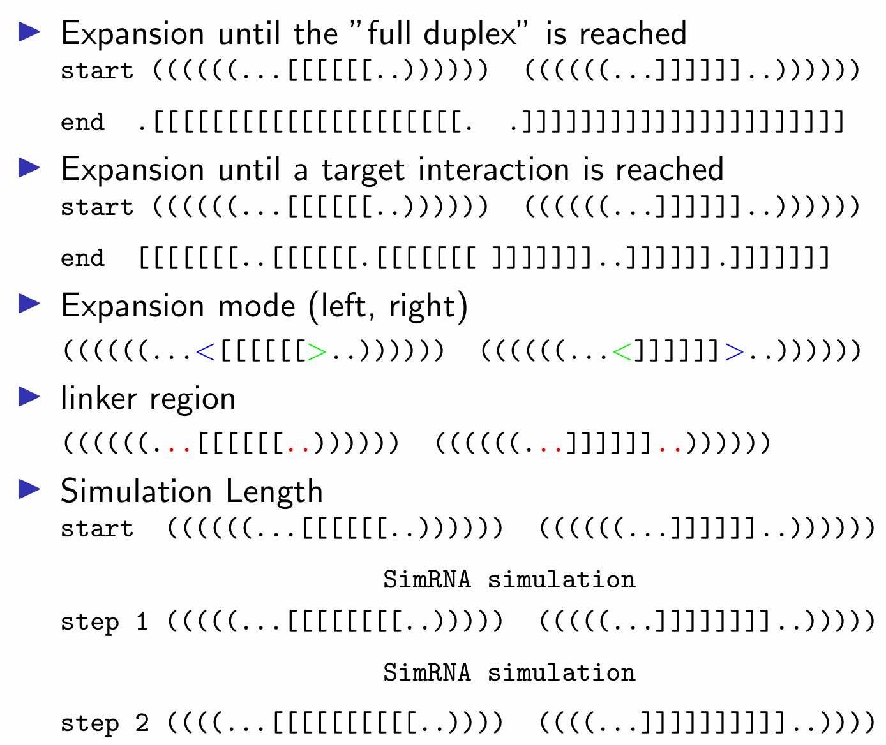

<!DOCTYPE html>
<html>

<body>

# Modeling the formation of RNA-RNA interactions in 3D

## Background and Motivation
  
Interactions between RNAs are an essential mechanism in cell regulation processes in all domains of life. In many cases, knowledge of the secondary (2D) structure is sufficient to understand the function of an RNA. There are already computationally efficient 2D tools for predicting reasonably accurate RNA structures that can easily be embedded in a 3D tertiary structure. However, when there are interactions or pseudoknots in the structure, predictions can be sterically infeasible or kinetically inaccessible. This is especially important when we want to observe RNA-RNA interaction trajectories.

## THE PIPELINE
  
Our computational pipeline can be used to decide whether pseudoknots or interactions proposed by 2D prediction are indeed sterically feasible and kinetically reachable. While 3D modeling of RNAs remains computationally challenging, our designed pipeline is efficient by using coarse grained representations to model 3D conformation changes as a series of small steps. At the end the models can be translated back to an atomic resolution. In sum, this offers us detailed insights into the structural dynamics of kissing hairpin formation. It explores to what extent 2D structure predictions are compromised by neglecting 3D structure modelling and allows us to suggest rules, such as maximal helix lengths, that can be used to filter or constrain 2D predictions.
  

  

### How can an expansion design look like:
  

### STARTING THE PIPELINE

  

  It is possible to start an interaction extension from an RNA sequence with the corresponding secondary structure (including the interaction start). For this purpose, the 3D start structure is predicted with the tool ernwin and converted into a full atom structure for the further pipline. For this purpose the script <code>combination.sh</code> is used. This start option additionally offers the possibility to calculate several sequence designs with one secondary structure (incl. interaction start) and one secondary target structure and to enter the pipeline with the respective design.    
  Alternatively, it is also possible to start from an already existing 3D structure in PDB format. For this prupose the script <code>coridanstart.sh</code> is used.   
  Both scripts can process multiple clusters of the respective 3D structure.    
  The input for the start of the pipeline is given by:
  

#### Input
<dl>
  <ol>
    <li> <code> inputvalues.dat </code>
      <table>
        <tr>
          <td><strong>VARIABLE</strong></td>
          <td><strong>VALUE/SAMPLE</strong></td>
          <td><strong>DESCRIPTION</strong></td>
          <td><strong>more Info</strong></td>
        </tr>
        <tr>
          <td>START </td>
          <td>/home/1zci</td>
          <td>Input path for all structure conditional files which are needed for the start and Output path </td>
          <td><a href="#needed structure files">[required files]</a></td>
        </tr>
        <tr>
          <td>BASENAME </td>
          <td>1zci</td>
          <td>Core name of the file/structure</td>
          <td></td>
        </tr>
        <tr>
          <td>NAME</td>
          <td>1zci</td>
          <td>???</td>
          <td></td>
        </tr>
        <tr>
          <td>PROGS</td>
          <td>/home/RRI3D</td>
          <td>Path to this git repro and its scripts </td>
          <td><a href="#skripts">[skripts]</a></td>
        </tr>
        <tr>
          <td>PROGS</td>
          <td>/home/RRI3D</td>
          <td>Path to this git repro</td>
          <td></td>
        </tr>
        <tr>
          <td>DESIGNS</td>
          <td>3</td>
          <td>specifies how many different RNA designs of this structure should be created and calculated</td>
          <td><a href="#RNAblueprint">[RNAblueprint]</a></td>
        </tr>
        <tr>
          <td>ERNWIN</td>
          <td>/home/ernwin</td>
          <td>Path to ernwin</td>
          <td><a href="#dependency">[dependency]</a></td>
        </tr>
        <tr>
          <td>ERNITERATIONS</td>
          <td>100000</td>
          <td>Number of structures to generate during ernwin simulation</td>
          <td><a href="#ernwin">[ernwin]</a></td>
        </tr>
        <tr>
          <td>ERNROUND</td>
          <td>10000</td>
          <td>Save the best (lowest rmsd) n structures during a ernwin simulation</td>
          <td><a href="#ernwin">[ernwin]</a></td>
        </tr>
        <tr>
          <td>FALLBACKSTATES</td>
          <td>true | false</td>
          <td>Over 50000 short artificial structures that can be used as fallback fragments when less or no examples of a secondary structure element could be found in the PDB. </td>
          <td><a href="#ernwin">[ernwin]</a></td>
        </tr>
        <tr>
          <td>CLUSTER</td>
          <td>10</td>
          <td>Cluster the ernwin structures based on the used coarse grained elements</td>
          <td><a href="#ernwin-script">[ernwin-script]</a></td>
        </tr>
        <tr>
          <td>SIMRNA</td> <a id="SimRNApath">
          <td>/home/simrna</td>
          <td>Path to simrna</td>
          <td><a href="#dependency">[dependency]</a></td>
        </tr>
        <tr>
          <td>WHERE</td>
          <td>local | cluster</td>
          <td>run the SimRNA simulation locally or on a slurm cluster</td>
          <td><a href="#dependency">[dependency]</a></td>
        </tr>
        <tr>
          <td>SIMROUND</td>
          <td>5</td>
          <td>Number of SimRNA runs with the same setting but a different seed. </td>
          <td><a href="#SimRNA">[SimRNA]</a></td>
        </tr>
        <tr>
          <td>TREESEARCH</td>
          <td>true | false</td>
          <td> </td>
          <td><a href="#network">[network]</a></td>
        </tr>
        <tr>
          <td>SEED</td>
          <td> step | random</td>
          <td>Setting the SimRNA seed; step correspond to the respective SIMROUND</td>
          <td><a href="#SimRNA">[SimRNA]</a></td>
        </tr>
        <tr>
          <td>TYPE</td>
          <td>expand</td>
          <td></td>
          <td><a href="#SimRNA">[SimRNA]</a></td>
        </tr>
        <tr>
          <td>RELAX</td>
          <td>expand_100000</td>
          <td>SimRNA settings for a first relaxed run</td>
          <td><a href="#SimRNA">[SimRNA]</a></td>
        </tr>
        <tr>
          <td>EXTEND</td>
          <td>expand_50000</td>
          <td>SimRNA settings for the expansion mode</td>
          <td><a href="#SimRNA">[SimRNA]</a></td>
        </tr>
        <tr>
          <td>ROUND</td>
          <td>0</td>
          <td>Start with Round <code></td>
          <td><a href="#expansion settings">[expansion settings]</a></td>
        </tr>
        <tr>
          <td>ROUNDS</td>
          <td>100</td>
          <td></td>
          <td><a href="#expansion settings">[expansion settings]</a></td>
        </tr>
        <tr>
          <td>ROUND</td>
          <td>0</td>
          <td></td>
          <td><a href="#expansion settings">[expansion settings]</a></td>
        </tr>
        <tr>
          <td>TARGET</td>
          <td>true | false</td>
          <td></td>
          <td> </td>
        </tr>
        <tr>
          <td>BUFFER</td>
          <td>2</td>
          <td></td>
          <td><a href="#expansion settings">[expansion settings]</a></td>
        </tr>
        <tr>
          <td>EXPANDBMODE</td>
          <td>1-5</td>
          <td></td>
          <td><a href="#expansion settings">[expansion settings]</a></td>
        </tr>
        <tr>
          <td>CONSECUTIVEPERFECT</td>
          <td>true | false | </td>
          <td></td>
          <td><a href="#continuousserach">[continuousserach]</a></td>
        </tr>
        <tr>
          <td>CONTSEARCH1</td>
          <td>force | interaction | </td>
          <td></td>
          <td><a href="#continuousserach">[continuousserach]</a></td>
        </tr>
        <tr>
          <td>CONTSEARCH2</td>
          <td>force | interaction | </td>
          <td></td>
          <td><a href="#continuousserach">[continuousserach]</a></td>
        </tr>
      </table>
    <li> Structure information
      
      <dl> Each filename must consist of the <a href="#BASENAME">BASENAME</a> and the respective ending and must be stored in the <a href="#START">START</a> .   For a smooth run through the pipline, the nucleodide sequence must be written in capital letters. Allowed are the four nucleobases: adenine, guanine, cytosine, uracil.</dl>
      <ul>
        <li>.fa</li>
          <dd>FASTA-FILE for <a href="#ernwin">ernwin_start</a></dd>
          <table>
            <tr>
              <td>>Name</td>
              <td><code>>1zci</code></td>
              <td>NAME = BASE NAME</td>
            </tr>
            <tr>
              <td>Sequence</td>
              <td><code>CUUGCUGAAGUGCACACAGCAAG&CUUGCUGAAGUGCACACAGCAAG</code></td>
              <td>The separator between two sequences is a & character</td>
            </tr>
            <tr>
              <td>Dotbracket</td>
              <td><code>(((((((..[[.....)))))))&.............]]........</code></td>
              <td>Single line dotbracket notation; each pseudonode/interaction is represented by a new bracket type e.g.b [ ], { }, < ></td>
            </tr>
          </table>
        <li>.seq</li>
            <dd>Usage: <a href="#SimRNA">SimRNA</a> & <a href="#skripts">pipeline-skripts</a></dd>
            <table>
              <tr>
                <td>Sequence</td>
                <td>
                <dl><code>CUUGCUGAAGUGCACACAGCAAG CUUGCUGAAGUGCACACAGCAAG</code></dl></td>
                </tr>
                <tr>
                <td colspan="2"> Same sequence as in fasta file but the separator between two sequences is a whitespace</td>
              </tr>
            </table>
        <li>.ss</li>
          <dd>Usage: <a href="#SimRNA">SimRNA</a> & <a href="#skripts">pipeline-skripts</a>  
              Represents the secondary structure constraint for the current extension round</dd>
          <table>
            <tr>
              <td>Dotbracket</td>
              <td>
                <dl><code>((((((.........))))))) (((((((.........)))))))</code> 
                    <code>.........((............ .............)).......</code></dl>
              </td></tr>
              <tr>
              <td colspan="2"> Dotbracket notation with classical round brackets and dots.  A "bracket" crossing requires the start of a new line, e.g. 1st line intramolecular structure, 2nd line interaction.  For the start of the simulation the .ss-file contains the native start dotbracket notation.</td>
            </tr>
          </table>
        <li>.ss_cc</li>
          <dd>Usage: <a href="#SimRNA">SimRNA</a> & <a href="#skripts">pipeline-skripts</a>  
          Secondary structure constraint from  for the current extension round</dd>
          <table>
            <tr>
              <td>Dotbracket</td>
              <td>
                <dl><code>((((((.........))))))) (((((((.........)))))))</code> 
                    <code>.........((............ .............)).......</code></dl>
              </td></tr>
              <tr>
              <td colspan="2">In the previous extension step achieved secondary structure.   For the first run it must conform to the .ss dotbracket notation by default.</td>
            </tr>
          </table>
        <li>.il</li>
          <dl>If no extension (no longer interaction) compared to the previous run is recorded in this file, the respective run stops. 
              Control file which specifies how many base pairs make up the extended interaction of the "best" structure of a run.  Must contain a <code>0</code> at the beginning.</dl>
        <li>_target.ss</li>
          <dd>Usage: <a href="#expansion settings">expansion settings</a>   
              Secondary structure to be reached</dd>
          <table>
            <tr>
              <td>Dotbracket</td>
              <td>
                <dl><code>(((((((.........))))))) (((((((.........)))))))</code> 
                    <code>.........((((.(........ .........).))))........</code></dl>
              </td></tr>
              <tr>
              <td colspan="2">Without a target structure the extension stops when no more complimentary base pairing is possible  -> Only needed if the extended target interaction contains bulges. </td>
            </tr>
          </table>
      </ul>
      <li> <code> config.dat </code>
        <dl>The config file contains the settings for a SimRNA run (see dependencies: <a href="#dependency">SimRNa</a>) and can be found <a href="#SimRNApath">here</a>. You can distinguish between the relaxing run after simulating the start structure (longer run recommended) and the runs to extend the interaction (short runs recommended).  
        In the folder  <code>SimRNA_config</code> you can find several example config files.</dl>
  </ol>
</dl>

## Available Skripts & Additional Features <a id="skripts">
<a href="#footer">Jump to footnote</a>
 
Footnote content

### <code> expandinteraction.py  </code>
  
Create dotbracket files with an interaction site between two RNA chains. 
  The expansion can be started from a dotbracket structure (SimRNA format), as well as from a base pair list. Allowed are complimentary (A-U, G-C) as well as G-U base pairings.  By default, the interaction will be extended by the closest base pair (without bulge). If no extension is possible in the respective step, the simulation stops. If a bulge is desired/structurally necessary it is recommended to specify a target structure to extend to. 
  An extension can be done to both sides of the interaction simultaneously, as well as to one side only. Another option is to extend the interaction by several base pairs in one step. Furthermore, a buffer/linker region without base pairing between intramolecular and intermolecular structure can be specified.   
  
  The following parsing options can be selected: 
  <table>
    <tr>
      <td><strong>FLAG</strong></td>
      <td><strong>NAME</strong></td>
      <td><strong>TYPE</strong></td>
      <td><strong>DEFAULT</strong></td>
      <td><strong>DESCRIPTION</strong></td>
    </tr>
    <tr>
      <td><code>-d </code></td>
      <td><code>--dotbracket </code></td>
      <td>path to file </td>
      <td>none </td>
      <td> Dotbracket structure in SimRNA style</td>
    </tr>
    <tr>
      <td><code>-x </code></td>
      <td><code>--basepairlist </code></td>
      <td>path to file </td>
      <td>none </td>
      <td>Basepair list e.g. ((....)) --> [[1,8],[2.7]]</td>
    </tr>
    <tr>
      <td><code>-n </code></td>
      <td><code>--nucleotides </code></td>
      <td>path to file </td>
      <td>none </td>
      <td>Nucleotide sequence </td>
    </tr>
    <tr>
      <td><code>-o </code></td>
      <td><code>--output </code></td>
      <td>path to file/filename </td>
      <td>none </td>
      <td>Path and name of the outputfile </td>
    </tr>
    <tr>
      <td><code>-t </code></td>
      <td><code>--target </code></td>
      <td>path to file </td>
      <td>none </td>
      <td>End/Target structure </td>
    </tr>
    <tr>
      <td><code>-s </code></td>
      <td><code>--stepsize </code></td>
      <td>int</td>
      <td>1 </td>
      <td>How many nucleotides should be added to the interaction (on one site).</td>
    </tr>
    <tr>
      <td><code>-r </code></td>
      <td><code>--right </code></td>
      <td>boolean </td>
      <td>default both TRUE</td>
      <td>Expand right </td>
    </tr>
    <tr>
      <td><code>-l </code></td>
      <td><code>--left </code></td>
      <td>boolean </td>
      <td>default both TRUE </td>
      <td>Expand left</td>
    </tr>
    <tr>
      <td><code>-b </code></td>
      <td><code>--buffer </code></td>
      <td>int </td>
      <td>0 </td>
      <td>Lngth of the buffer/linker region, no intra- and interaction allowed, before and after the interaction site. </td>
    </tr>
    <tr>
      <td><code>-v </code></td>
      <td><code>--verbose </code></td>
      <td>store_true</td>
      <td>FALSE </td>
      <td>Be verbose </td>
    </tr>
  </table>

<strong>Further Descriptions & Examples</strong>  
  <table>
    <tr>
      <td>Expand the interaction right (-r) or left (-l):</td></tr>
      <td>
        <dl><code>((((.............)))) ((((.(((...............)))))))</code> 
            <code>....R(((((((((((L.... .........L)))))))))))R........</code></dl>
      </td></tr>
      <tr><td> -b 2 / --buffer 2 </td></tr>
      <td>
        <dl><code>(---............---)) ((((.((---...........---))))))</code> 
            <code>....R(((((((((((L.... .........L)))))))))))R........</code></dl>
      </td></tr>
    </tr>
  </table>

### <code> RNAdesign.py </code> 
  

  Design RNA sequences for two specific secondary structures with RNAblueprint. 
  RNAblueprint is a library to sample sequences that are compatible with multiple
  structure constraints. This allows us to generate multi-stable RNAs, i.e. RNAs
  that switch between multiple predefined structures. 
  The main function performs a simple optimization procedure using simulated annealing.
  The crucial part is the objective() function, which is designed such that it
  becomes minimal when the Boltzmann ensemble is dominated by the two target
  structures. 

  The following parsing options can be selected: 
  <table>
   <tr>
     <td><strong>FLAG</strong></td>
     <td><strong>NAME</strong></td>
     <td><strong>TYPE</strong></td>
     <td><strong>DEFAULT</strong></td>
     <td><strong>DESCRIPTION</strong></td>
   </tr>
   <tr>
     <td><code>-i </code></td>
     <td><code>--input </code></td>
     <td>path to file </td>
     <td>if not given - use default testinput </td>
     <td>Secondary Structure - SimRNA format</td>
   </tr>
   <tr>
     <td><code>-i </code></td>
     <td><code>--input </code></td>
     <td>path to file </td>
     <td>testinput </td>
     <td>Secondary Structure - SimRNA format</td>
   </tr>
   <tr>
     <td><code>-o </code></td>
     <td><code>--output </code></td>
     <td>filename</td>
     <td>design</td>
     <td>Name of the outputfiles. The designs will be saved with the following filename:
         name + 'design'+ consecutive designnumber.seq</td>
   </tr>
   <tr>
     <td><code>-n </code></td>
     <td><code>--number </code></td>
     <td>int</td>
     <td>10</td>
     <td>Number of designs</td>
   </tr>
   <tr>
     <td><code>-s </code></td>
     <td><code>--selection </code></td>
     <td>int</td>
     <td>5</td>
     <td>Number of selected Designs that will be saved as .seq file</td>
   </tr>
   <tr>
     <td><code>-v </code></td>
     <td><code>--verbose </code></td>
     <td>store_true</td>
     <td>FALSE </td>
     <td>Be verbose </td>
   </tr>
   </table>

   <dl>
   <strong>Further Descriptions & Examples</strong>  
       <dl>The input: 
       The first structure describes the two seperate hairpins with a connection element (A)
       the second structure should ensure the complementarity cleaveage of the two hairpins.
       With the objective2 function every designed hearpin will be evaluated separately.</dl>
       <table>
         <tr>
           <td>
             <dl><code>1  (((((((.........))))))) (((((((.........)))))))</code> 
                 <code>2  ((((((((((((((((((((((( )))))))))))))))))))))))</code></dl>
           </td></tr>
      </table>

### <code> formattranslation.py </code> 
  
Transform the Dotbracket structure and the nucleatide sequence form several
  RNA designs into seperate fasta files (needed for the ernwin simualtion).
  

  <table>
   <tr>
     <td><strong>FLAG</strong></td>
     <td><strong>NAME</strong></td>
     <td><strong>TYPE</strong></td>
     <td><strong>DEFAULT</strong></td>
     <td><strong>DESCRIPTION</strong></td>
   </tr>
   <tr>
     <td><code>-p </code></td>
     <td><code>--path </code></td>
     <td>path to files </td>
     <td>none</td>
     <td>Path to Inputfiles: 
      <code>*_0.ss</code>, 
       <code>*.seq</code></td>
   </tr>
   <tr>
     <td><code>-n </code></td>
     <td><code>--name </code></td>
     <td>filename </td>
     <td>none</td>
     <td>BASENAME</td>
   </tr>
   <tr>
     <td><code>-c </code></td>
     <td><code>--count </code></td>
     <td>int </td>
     <td>none</td>
     <td>Number of samples/designs</td>
   </tr>
   <tr>
     <td><code>-v </code></td>
     <td><code>--verbose </code></td>
     <td>store_true</td>
     <td>FALSE </td>
     <td>Be verbose </td>
   </tr>
  </table>

  <strong>Further Descriptions & Examples</strong>  
    <dl> TESTINPUT  
    <code>> python formattranslation.py -p PATHtoINPUTFILES -n NAMEofINPUTFILES -c 100</code>
    </dl>

### <code> ernwindiversity.py </code> 

Cluster the ernwin structures based on the used fragments. Output is a list with all clusters each started with the structure with the best (min) energy.

  <table>
   <tr>
     <td><strong>FLAG</strong></td>
     <td><strong>NAME</strong></td>
     <td><strong>TYPE</strong></td>
     <td><strong>DEFAULT</strong></td>
     <td><strong>DESCRIPTION</strong></td>
   </tr>
   <tr>
     <td><code>-i </code></td>
     <td><code>--input </code></td>
     <td>path to files </td>
     <td>none</td>
     <td>Path to the ernwin <code>.coord</code>-files</td>
   </tr>
   <tr>
     <td><code>-n </code></td>
     <td><code>--number</code></td>
     <td>int </td>
     <td>none</td>
     <td>Number of saved ernwin structures = <code>--save-n-best</code> in ernwin call</td>
   </tr>
   <tr>
     <td><code>-c </code></td>
     <td><code>--cluster </code></td>
     <td>int </td>
     <td>none</td>
     <td>Number of clusters</td>
   </tr>
   <tr>
     <td><code>-v </code></td>
     <td><code>--verbose </code></td>
     <td>store_true</td>
     <td>FALSE </td>
     <td>Be verbose </td>
   </tr>
  </table>

### <code> ernwinsearch.py </code> 
  

  Find the structure from a ernwin out.log-file with the best minimum free.  
  Output: number of the ernwin sample
  

  <table>
   <tr>
     <td><strong>FLAG</strong></td>
     <td><strong>NAME</strong></td>
     <td><strong>TYPE</strong></td>
     <td><strong>DEFAULT</strong></td>
     <td><strong>DESCRIPTION</strong></td>
   </tr>
   <tr>
     <td><code>-i </code></td>
     <td><code>--input </code></td>
     <td>path to files </td>
     <td>none</td>
     <td>Path to the ernwin <code>out.log</code> file</td>
   </tr>
   <tr>
     <td><code>-v </code></td>
     <td><code>--verbose </code></td>
     <td>store_true</td>
     <td>FALSE </td>
     <td>Be verbose </td>
   </tr>
  </table>

  
 <strong>Values available in ernwin <code>out.log</code> file: </strong> 
  Step, Sampling_Energy, Constituing_Energies, ROG, ACC, Asphericity, Anisotropy, Local-Coverage, Tracked Energy, Tracked Energy, Tracked Energy, time, Sampling Move, Rej.Clashes, Rej.BadMls
  

### <code> traflminE.py </code> 
  
 Extract the structure (trafl-line) with the best constrained minimum free
  energy from a traflfile.  
  Output min.trafl file
  

  <table>
   <tr>
     <td><strong>FLAG</strong></td>
     <td><strong>NAME</strong></td>
     <td><strong>TYPE</strong></td>
     <td><strong>DEFAULT</strong></td>
     <td><strong>DESCRIPTION</strong></td>
   </tr>
   <tr>
     <td><code>-i </code></td>
     <td><code>--input </code></td>
     <td>name of the inputfile </td>
     <td>none</td>
     <td>Input .trafl an outputfile from SimRNA</td>
   </tr>
   <tr>
     <td><code>-p </code></td>
     <td><code>--path </code></td>
     <td>path for the input/output file </td>
     <td>none</td>
     <td>   </td>
   </tr>
   <tr>
     <td><code>-o </code></td>
     <td><code>--output </code></td>
     <td>name of the outputfile</td>
     <td>none</td>
     <td>Output .trafl</td>
   </tr>
   <tr>
     <td><code>-v </code></td>
     <td><code>--verbose </code></td>
     <td>store_true</td>
     <td>FALSE </td>
     <td>Be verbose </td>
   </tr>
  </table>

  
 <strong>Values available in SimRNA <code>trafl</code> file: </strong> 
  consec_write_number, replica_number, energy_value_plus_restraints_score, energy_value, current_temperature, datapoints 
 

  
 <strong>Note</strong> 
  The function to read/write the structure with the minimum free from a trafl file is also provided by SimRNA directly.In this case, however, the energy_value is used without the constraint - here in this script primarily the energy value plus restraints score. Furthermore, the SimRNA script is only available in a python3 environment. Alternatively this script can be used. 

### <code> ssalignment.py </code> 
  

  Compare all secondary structures files (calculated via SimRNA – SimRNA-style) with the start ss-sequence, the constrained ss-sequence and with each other.
  For comparing the energy the SimRNA trafl file is used.

  The first output is a csv-file with the following information regarding one specific random number seed of a full run:
  number, sequence, count_constraint, count_start, count_before, constancy, dif_constraint, dif_start, dif_before, bp, time, energy_values_plus_restraint_score, energy_value, current_temp, interaction, len_interaction, count_interaction_constraint, dif_interaction_cc

  The second output is a csv.file with all unique structures over several (offered) random number seeds of a full run:
  sequence, count_how_often, count_constraint, count_start, dif_constraint, dif_start, bp, bpstr, interaction, len_interaction, count_interaction_constraint, dif_interaction_cc
  

  <table>
   <tr>
     <td><strong>FLAG</strong></td>
     <td><strong>NAME</strong></td>
     <td><strong>TYPE</strong></td>
     <td><strong>DEFAULT</strong></td>
     <td><strong>DESCRIPTION</strong></td>
   </tr>
   <tr>
     <td><code>-p </code></td>
     <td><code>--path </code></td>
     <td>path to file</td>
     <td>none </td>
     <td>Path to SimRNAfiles for input </td>
   </tr>
   <tr>
     <td><code>-i </code></td>
     <td><code>--input </code></td>
     <td>filename</td>
     <td>none</td>
     <td>Input ss-sequence</td>
   </tr>
   <tr>
     <td><code>-c </code></td>
     <td><code>--constraint </code></td>
     <td>filename</td>
     <td>none</td>
     <td>Constrained ss-sequence</td>
   </tr>
   <tr>
     <td><code>-t </code></td>
     <td><code>--trafl </code></td>
     <td>filename</td>
     <td>none</td>
     <td>Traflfile</td>
   </tr>
   <tr>
     <td><code>-o </code></td>
     <td><code>--output </code></td>
     <td>filename</td>
     <td>none</td>
     <td>Name of the outputfile</td>
   </tr>
   <tr>
     <td><code>-m </code></td>
     <td><code>--outputmode </code></td>
     <td>choices= 'w','a'</td>
     <td>'w'</td>
     <td>Overwrite ('w') or append ('a')</td>
   </tr>
   <tr>
     <td><code>-u </code></td>
     <td><code>--uniqueoutput </code></td>
     <td>filename</td>
     <td>none</td>
     <td>Name of the unique outputfile/or the already existing one</td>
   </tr>
   <tr>
     <td><code>-v </code></td>
     <td><code>--verbose </code></td>
     <td>store_true</td>
     <td>FALSE </td>
     <td>Be verbose </td>
   </tr>
  </table>

  
 <strong>Sample: </strong> 
 
  <code> > python3 SSalignment.py p /place/with/all/ss-quences -i ss-constrain -c ssstart -o firstoutput.csv -u secondoutput.csv -m 'w' -t traflfile </code>

### <code> continoussearch.py </code> 
  

  Find the best 3D structure after a SimRNA surface run and the SSAllignment analysis
  Parse over all SSalignment files (individual runs and the overview).
  Looking for the most common secondary  structure in the overview file.
  Look for this secondary structure in all individual runs and seperate them (max_file).
  The structure with the best energy (3D) is the one for the next constrained SimRNA run in the pipeline
  

  <table>
   <tr>
     <td><strong>FLAG</strong></td>
     <td><strong>NAME</strong></td>
     <td><strong>TYPE</strong></td>
     <td><strong>DEFAULT</strong></td>
     <td><strong>DESCRIPTION</strong></td>
   </tr>
   <tr>
     <td><code>-p </code></td>
     <td><code>--path </code></td>
     <td>path to file</td>
     <td>none </td>
     <td>Path to Inputfiles </td>
   </tr>
   <td><code> </code></td>
   <td><code>--printout </code></td>
   <td>store_true</td>
   <td>none </td>
   <td>Print a csv-file with all minEnergy relevant files</td>
   </tr>
   </tr>
   <td><code>-f </code></td>
   <td><code>--force </code></td>
   <td>store_true</td>
   <td>none </td>
   <td>Instead of the most common secondary structure: find the secundary-structures most similar to the contrained one</td>
   </tr>
   </tr>
   <td><code> </code></td>
   <td><code>--interaction </code></td>
   <td>store_true</td>
   <td>none </td>
   <td>Instead of the most common secondary structure: Find the interaction-structure most similar to the contrained one</td>
   </tr>
   </tr>
   <td><code> </code></td>
   <td><code>--first </code></td>
   <td> name </td>
   <td>none </td>
   <td>Verify the first line in the dataframe - FILENAME for the first line e.g 1zci_00.ss</td>
   </tr>
   </tr>
   <td><code> </code></td>
   <td><code>--second </code></td>
   <td> name </td>
   <td>none </td>
   <td>Verify the second line in the dataframe - FILENAME for the second line e.g 1zci_00.ss_cc</td>
   </tr>
   </tr>
   <td><code>-i </code></td>
   <td><code>--initialname </code></td>
   <td> name </td>
   <td>none </td>
   <td>e.g. 1zci_01, 1zci_02, ...</td>
   </tr>
   </tr>
   <td><code>-c </code></td>
   <td><code>--consecutive </code></td>
   <td>boolean</td>
   <td>none</td>
   <td><a href="#CONSECUTIVEPERFECT">CONSECUTIVEPERFECT</a> true/false</td>
   </tr>
   <tr>
     <td><code>-v </code></td>
     <td><code>--verbose </code></td>
     <td>store_true</td>
     <td>FALSE </td>
     <td>Be verbose </td>
   </tr>
  </table>

  
 <strong>Sample: </strong> 
 
  <code> >python3 continoussearch.py -p 00/surface/analyse/ --print --first 'CopStems_00.ss' --second 'CopStems_00_00_000000.ss' -f </code>

## Dependencies 
<dl>
  <dt>python 3.7</dt>
    <ul> - Standard packeges: argparse, collections,csv, disutils, glob, itertools, json, logging, operator, optparse, os, random, re, sys, math </ul>
    <ul>- more-itertools V.8.4.0 </ul>
    <ul>- numpy V.1.20.1 </ul>
    <ul>- pandas V.1.2.2 </ul>
    <ul>- scikit-learn V.0.24.1 </ul>
  <dt>SimRNA <a href="https://genesilico.pl/SimRNAweb">[link]</a></dt>
  <dt>Ernwin <a href="https://github.com/ViennaRNA/ernwin">[link]</a></dt>
    
& for ernwin use: 

    <ul>- python 2 </ul>
    <ul>- forgi <a href="https://github.com/ViennaRNA/forgi">[link]</a> </ul>
    <ul>- Note: incl. setup for all-atom reconstruction </ul>
  <dt>for RNA design:</dt>
    <ul>- ViennaRNA package <a href="https://www.tbi.univie.ac.at/RNA/">[link]</a> </ul>
    <ul>- RNAblueprint <a href="https://github.com/ViennaRNA/RNAblueprint">[link]</a> </ul>
</dl>

###### References

<dl>
  <dt>If you use this software package, please cite the follwing publication: </dt>
    <ul>WILL BE ANNOUNCED </ul>

  <dt>For the pipeline presented here, some of the following already published software-features were used: </dt>
    <ul><a href="https://doi.org/10.12688/f1000research.18458.2">B.C, Thiel et al. (2019) "3D based on 2D: Calculating helix angles and stacking patterns using forgi 2.0, an RNA Python library centered on secondary structure elements." F1000Research, 8:287</a></ul>
    <ul><a href="https://doi.org/10.1261/rna.047522.114">P. Kerpedjiev P et al. (2015)"Predicting RNA 3D structure using a coarse-grain helix-centered model" RNA. 21(6): 1110–1121</a></ul>
    <ul><a href="https://doi.org/10.1093/nar/gkv1479">M.J. Boniecki et al. (2016) “SimRNA: a coarse-grained method for RNA folding simulations and 3D structure prediction” Nucleic acids research vol. 44,7: e63</a> </ul>
    <ul><a href="https://doi.org/10.1093/bioinformatics/btx263">S. Hammer et al. (2017) "RNAblueprint: flexible multiple target nucleic acid sequence design" Bioinformatics vol. 33, Issue 18, pp 2850–2858</a></ul>
    <ul><a href="https://doi.org/10.1186/1748-7188-6-26">R. Lorenz et al. (2011), "ViennaRNA Package 2.0", Algorithms for Molecular Biology, 6:26</a></ul>
    <ul><a href="https://doi.org/10.1007/BF00818163">I.L. Hofacker et al. (1994), "Fast folding and comparison of RNA secondary structures", Monatshefte fuer Chemie, vol. 125, Issue 2, pp 167-188</a></ul>
  </dl>

</body>
</html>
